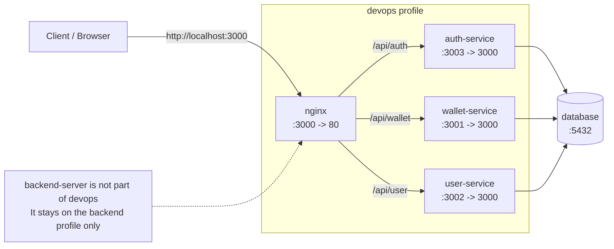

# DevOps Profile Topology

This map shows the container connections for the `devops` profile.

```mermaid
flowchart LR
  client[Client / Browser]

  subgraph devops[devops profile]
    nginx[nginx\n:3000 -> 80]
    auth[auth-service\n:3003 -> 3000]
    wallet[wallet-service\n:3001 -> 3000]
    user[user-service\n:3002 -> 3000]
  end

  db[(database\n:5432)]

  client -->|http://localhost:3000| nginx
  nginx -->|/api/auth| auth
  nginx -->|/api/wallet| wallet
  nginx -->|/api/user| user

  auth --> db
  wallet --> db
  user --> db

  note[backend-server is not part of devops\nIt stays on the backend profile only]

  note -.-> nginx
```